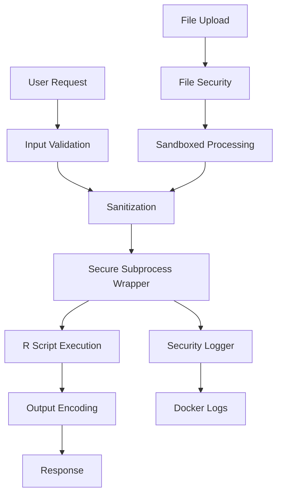

# Security Enhancement Plan for Meta-Analysis Chatbot

## Overview
This plan addresses critical security vulnerabilities in the meta-analysis chatbot, prioritizing command injection fixes while maintaining performance for Docker deployment.

## Priority 1: Command Injection Prevention (Critical)

### 1. Secure Subprocess Wrapper
**File**: `utils/secure_subprocess.py`
- Replace all `subprocess.Popen` calls with secure wrapper
- Implement command whitelisting
- Use shlex for proper argument escaping
- Prevent shell=True usage
- Add timeout protection

**Affected Files**:
- `app.py` (lines 56-74)
- `server.py` (lines 48-60)
- `chatbot_app.py` (lines 140-159)
- All other subprocess calls

### 2. R Script Input Sanitization
**File**: `utils/r_sanitizer.py`
- Sanitize all inputs before passing to R scripts
- Remove shell metacharacters
- Validate data types and formats
- Implement safe JSON serialization

**Critical Areas**:
- `scripts/entry/mcp_tools.R` - JSON argument parsing
- `scripts/tools/upload_data.R` - File content processing
- All R tool invocations

## Priority 2: Input Validation & File Security

### 3. Centralized Input Validation
**File**: `utils/validators.py`
- Data type validators (numeric, string, boolean)
- Format validators (email, URL, session ID)
- Length and size validators
- Pattern validators with whitelisting
- Meta-analysis specific validators

### 4. Secure File Upload System
**File**: `utils/file_security.py`
- Enhanced file type validation
- Content-based file type detection
- Size limits enforcement (50MB max)
- Sandboxed file processing
- Temporary file cleanup

## Priority 3: Output Security & Logging

### 5. Context-Aware Output Encoding
**File**: `utils/encoders.py`
- HTML encoding for web outputs
- JSON encoding with proper escaping
- CSV encoding for data exports
- Prevent XSS in Gradio interfaces

### 6. Lightweight Security Logging
**File**: `utils/security_logger.py`
- Log security events without performance impact
- Track file uploads and R executions
- Monitor subprocess calls
- Structured logging for Docker

## Docker-Specific Security

### 7. Docker Security Configuration
**Files**: `Dockerfile.secure`, `docker-compose.secure.yml`
- Non-root user execution
- Read-only root filesystem
- Minimal base image (alpine)
- Security scanning integration
- Resource limits
- Network isolation

## Implementation Architecture

## Performance Optimizations

1. **Caching**: Cache validation results for repeated inputs
2. **Async Processing**: Use async for I/O operations
3. **Efficient Regex**: Pre-compile regex patterns
4. **Minimal Logging**: Log only security-relevant events
5. **Connection Pooling**: Reuse subprocess connections where possible

## Quick Wins (Implement First)

1. **Disable shell=True**: Search and replace all subprocess calls
2. **Add shlex.quote()**: For all command arguments
3. **Input length limits**: Add max length to all text inputs
4. **File extension whitelist**: Restrict to .csv, .xlsx only
5. **Remove dangerous R functions**: Block system(), shell() in R

## Testing Strategy

1. **Unit Tests**: For each security module
2. **Integration Tests**: For subprocess wrapper
3. **Penetration Tests**: Command injection attempts
4. **Performance Tests**: Ensure < 10% overhead
5. **Docker Security Scan**: Using Trivy or similar

## Deployment Checklist

- [ ] All subprocess calls use secure wrapper
- [ ] Input validation on all user inputs
- [ ] File uploads properly sandboxed
- [ ] Docker image scanned for vulnerabilities
- [ ] Security logs properly configured
- [ ] Performance benchmarks pass
- [ ] Documentation updated